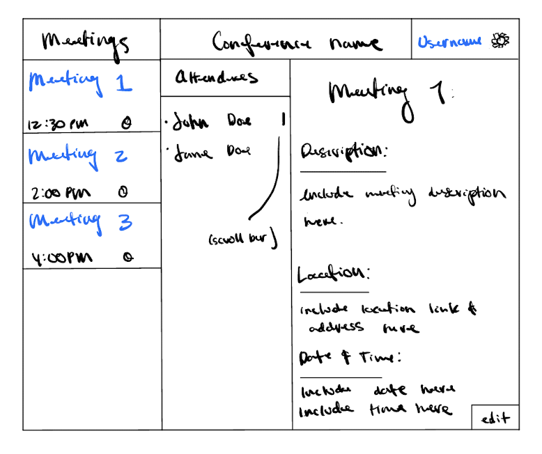

# Conference Scheduler

## Description Deliverables

### Elevator Pitch

Where can organizations find and application to organize their conferences? Many meeting application exist, but Conference Scheduler is focused on conference specific purposes. The user interface, features and backend architecture allow users to create and update events in real time, view the number of attendees committed to the event, and specify important details event attendees will need to know, such at event time and location. 

### Design

Use notability to make backend diagram here:

*Picture*

### Key Features

+ Secure login page
+ Creation of meetings
+ Ability to create, edit, and administrate meeting details
+ Display of attendees
+ Real time updates of attendee information and meeting details

### Technologies

Conference Scheduler will use the following:

+ **HTML:** Implements Two pages. One page is and welcome page to sign in or create an account and create a conference. The second page is for creating conference events and viewing event details.
+ **CSS:** Adjust application page to different window sizes, customize webpage color, and edit line design. 
+ **Javascript:** Supports a login and account feature, meeting pages, apply meeting detail edits, and attendee submissions.
+ **Service:**
    + Login
    + Accept meeting and conference detail edits
    + Broadcast meeting and conference detail information to attendees
    + Accept Attendee submissions
+ **DB:** Store administrator, attendees, and meeting and conference details in a database.
+ **Login:** Allow users to make an Conference Scheduler account. Ensure security and safety of account information and provides user authentication.
+ **Websocket:** Will broadcast meeting information to all Conference Scheduler users and update meeting attendee list in real time.
+ **React:** Will take advantage of React web framework.

### HTML Deliverable

Conference Scheduler will use the following HTML format:

+ **HTML Pages:** One page to provide login and conference creation. A second page to edit and display meeting and attendee details.
+ **Links:** The login and conference page will directly lead to the meeting details page. The meeting page will link to meeting and attendee details on the same page.
+ **Text:** Meeting and attendee information will be displayed in text.
+ **Images:** Each meeting detail view will have an alloted space to provide an image.
+ **Login:** A username and password input box and input box to create a user account.
+ **Database:** Meeting details and attendee submission information represents data stored in the database.
+ **WebSocket:** Meeting details and attendee submission lists represent realtime updates.

### CSS Deliverable

Conference Scheduler will apply the following CSS features:

+ **Header, Footer, and Main Content Body**
+ **Navigation Elements:** The meetings detail view includes scroll tabs and lines to separate meetings and meeting detail views.
+ **Window Re-sizing:** Conference Scheduler will resize to any window size.
+ **Application Elements:** Window coloring and simple intuitive meeting view user interface. 
+ **Application Images:** Each meeting detail will placed space for an image.

### Javascript Deliverable

Conference Scheduler will use Javascript primarily to provide manipulation and creation of meeting and conference details.

+ **Login:** Entering the correct user account information and pressing login button change the webpage to the meeting or conference detail view.
+ **Database:** Meeting and attendee submission details are stored in a database I hope will be via the cloud. Right now my database is local.
+ **WebSocket:** I will use a function to update the meeting details and attendee list each minute.
+ **Application Logic:** The color of the meeting tab will change in the meetings scroll bar based on what meeting is selected.

### Service Deliverable

Conference Scheduler will apply its services in the following ways:

+ **Node.js/Express HTTP Service:** I have het to complete this task.
+ **Static Middleware for Frontend:** I have also not yet completed this task.
+ **Calls to Third Party Endpoints:** I will study this service ensure I use it correctly.
+ **Backend Service Endpoints:** I will apply this later in the course.
+ **Frontend Calls to Service Endpoints:** I will apply this later in the course.

### DB Deliverable

Conference Scheduler will use a certain database to store and broadcast data, most likely MongoDB.

+ **Create MongoDB Atlas Database:** Unfinished.
+ **Endpoints for Data:** Unfinished.
+ **Store data with MongoDB:** Unfinished.

### Login Deliverable

Conference Scheduler will include the following login features:

+ **Account Registration:** Allow creation and storage of new user credentials in the database.
+ **Existing User Authentication:** Verifies correct user account credentials before use can access conference and meeting administration.
+ **Restrictions:** Attendees cannot edit meetings without administrator authorization.

### Websocket Deliverable

Conference Scheduler will update meeting and attendee details by implementing the following process:

+ **Backend Communicates with WebSocket Connection:** Unfinished.
+ **Frontend end connects with WebSocket:** Unfinished.
+ **WebSocket Allows for Data Transaction:** Unfinished.
+ **Data from WebSocket is Displayed in Conference Scheduler:** Unfinished.

### React Deliverable

Conference Scheduler implements React in the following ways:

+ **Bundle and Transpile:** Unfinished.
+ **Components:** Login, Meeting details, attendee information.
+ **Router:** Transportation from login page to meeting detail page.
+ **Hooks:** Unfinished. 
### References

See the following link to my GitHub for this project:

[Conference Scheduler](https://github.com/sorentys/startup)

The following README is structured after a Startup deliverable GitHub page:

[Startup Specification](https://github.com/webprogramming260/.github/blob/main/profile/essentials/startupSpec/startupSpec.md)
